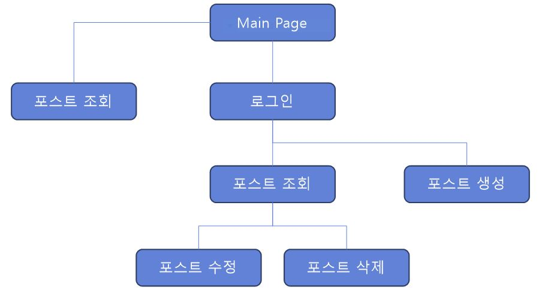
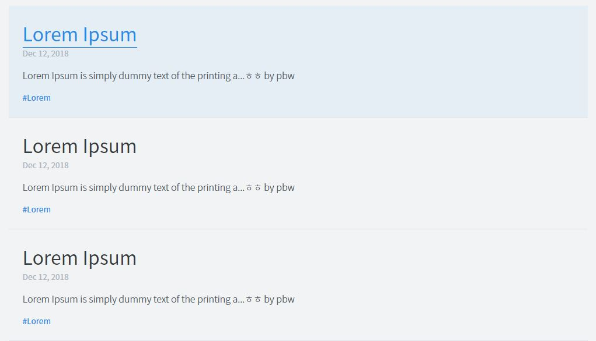
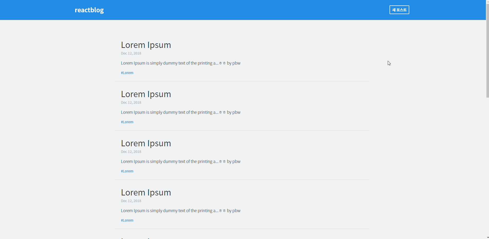
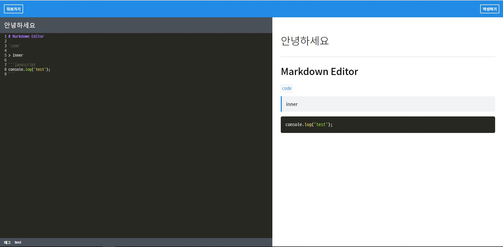
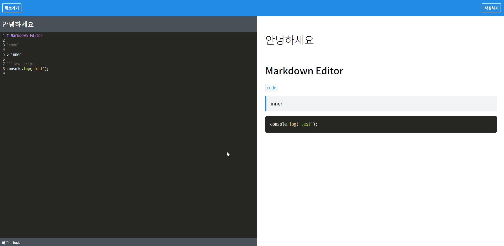
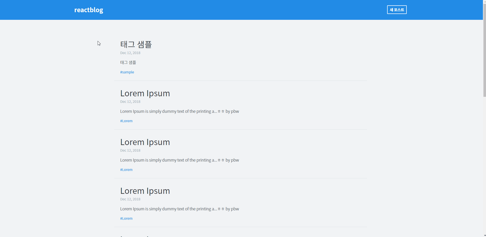
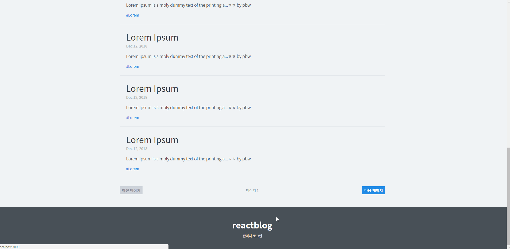

# React-blog

> [Next-TS로 교체중입니다.](https://github.com/ZungTa/React-Blog-Next-TS)

## 목차

- [개요](#개요)
- [제작과정](#제작과정)
- [개발 환경](#개발-환경)
- [주요 기술](#주요-기술)
- [세부내용](#세부내용)
    - [웹 사이트 구조](#웹-사이트-구조)
    - [전체 Process](#전체-Process)
    - [REST API](#REST-API)
    - [주요 기능](#주요-기능)
- [실행 방법](#실행-방법)    

## 개요

-   마크다운 에디터로 작성하는 블로그

## 제작과정

-   프로젝트 명 : blog
-   수행기간 : 2018년 9월 ~ 2018년 12월
-   프로젝트 인원 : 1명

## 개발 환경

-   **OS** : Windows 10
-   **IDE** : Visual Studio Code
-   **Browser** : Chrome
-   **Programming Languages**
    - HTML
    - css
        - CSS Module, Sass
    - JavaScript
        - ES6
        - node.js (ver 8.12.0)
        - koa.js (ver 2.6.2)
        - React.js (ver 16.6.3)
            - create-react-app v2
    - MongoDB (ver 4.0)
        - Robo 3T (ver 1.2)

## 주요 기술

- 다양한 library 사용
    - [redux](https://www.npmjs.com/package/redux) (ver 4.0.1)
    - [react-redux](https://www.npmjs.com/package/react-redux) (ver 5.1.1)
    - [redux-actions](https://www.npmjs.com/package/redux-actions) (ver 2.6.4)
    - [redux-pender](https://www.npmjs.com/package/redux-pender) (ver 1.2.1)
    - [react-router-dom](https://www.npmjs.com/package/react-router-dom) (ver 4.3.1)
    - [axios](https://www.npmjs.com/package/axios) (ver 0.18.0)
    - [query-string](https://www.npmjs.com/package/query-string) (ver 5.1.1)
    - [immutable.js](https://www.npmjs.com/package/immutable) (ver 4.0.0)
    - [codemirror](https://www.npmjs.com/package/codemirror) (ver 5.42.0)
    - [marked](https://www.npmjs.com/package/marked) (ver 0.5.2)
    - [prismjs](https://www.npmjs.com/package/prismjs) (ver 1.15.0)
    - [moment](https://www.npmjs.com/package/moment) (ver 2.22.2)
    - [open-color](https://www.npmjs.com/package/open-color) (ver 1.6.3)
    - [classNames](https://www.npmjs.com/package/classnames) (ver 2.2.6)
    - [dotenv](https://www.npmjs.com/package/dotenv) (ver 6.0.0)
    - [react-helmet](https://www.npmjs.com/package/react-helmet) (ver 5.2.0)
- Redux를 이용한 상태 관리
- Single Page Application
- Login 기능
- 마크다운 에디터로 블로그 작성
- Pagination 기능
- tag 기능
- REST API
- keyframes
- react-helmet으로 head 설정

## 세부내용

### 웹 사이트 구조



### 전체 Process


### REST API

| 종류                | 기능                |
| ------------------- | :----------------- |
| POST `/posts`       | 포스트 작성         |
| GET `/posts`        | 포스트 목록 조회     |
| GET `/posts/:id`    | 특정 포스트 조회     |
| DELETE `/posts/:id` | 특정 포스트 삭제     |
| PATCH `/posts/:id`  | 특정 포스트 업데이트 |

### 주요 기능

- **Login**

  `blog-backend/.env`
  ```js
  ADMIN_PASS=react
  ```

  `blog-backend/src/index.js`
  ```js
  const session = require('koa-session');

  ...

  const {
    ...
    COOKIE_SIGN_KEY: signKey
  } = process.env;

  ...

  const sessionConfig = {
    maxAge: 86400000, // 하루
  }

  app.use(session(sessionConfig, app));
  app.keys = [signKey];
  ```
  > koa-session을 이용하여 로그인을 구현하였다.  
  > logged값을 설정하여 로그인상태를 구분하였다.  

  `blog-backend/src/api/posts/index.js`
  ```js
  posts.post('/', postCtrl.checkLogin, postCtrl.write);
  posts.delete('/:id', postCtrl.checkLogin, postCtrl.checkObjectId, postCtrl.remove);
  posts.patch('/:id', postCtrl.checkLogin, postCtrl.checkObjectId, postCtrl.update);
  ```
  > backend에서 생성, 수정, 삭제 api에서 checkLogin으로 먼저 검증한다.  
  > 비 로그인 상태에서는 게시글 조회만 가능하다.  
  > 정해둔 비밀번호로 관리자 로그인을 하면 포스트 생성, 수정, 삭제가 가능하다.

- **포스트 내용 미리보기**

  

  `blog-backend/src/api/posts/posts.ctrl.js`
  ```js
  const limitBodyLength = post => ({
        ...post,
        body: post.body.length < 200 ? post.body : `${post.body.slice(0, 50)}...ㅎㅎ by pbw`
  })
  ctx.body = posts.map(limitBodyLength);
  ```

  > 200자가 넘으면 50자 정도만 잘라서 보여준다.  
  > 마지막에 ㅎㅎ by pbw는 실험적으로 붙여보았다.

- **Pagination**

  

  `blog-backend/src/api/posts/posts.ctrl.js`
  ```js
  const posts = await Post.find(query)
            ...
            .limit(10)
            .skip((page - 1) * 10)
            ...
  ```

  > frontend에서 포스트 리스트를 요청 할 때 page값을 넘겨 주면  
  > backend에서 skip(offset)과 limit로 해당 페이지에 맞게  
  > 10개 분량의 포스트를 응답해준다.

  `blog-backend/src/api/posts/posts.ctrl.js`
  ```js
  ctx.set('Last-Page', Math.ceil(pageCount / 10));
  ```

  `blog-frontend/src/store/modules/list.js`
  ```js
  const lastPage = action.payload.headers['last-page'];
  return state.set('posts', fromJS(posts))
              .set('lastPage', parseInt(lastPage, 10));
  ```
  `blog-frontend/src/components/list/Pagination/Pagination.js`
  ```js
  <Button disabled={page === lastPage} to={createPagePath(page+1)}>
    다음 페이지
  </Button>
  ```

  > 첫 페이지에서는 이전 페이지 버튼이 비활성화 되고  
  > 마지막 페이지에서는 다음 페이지 버튼이 비활성화 된다.  
  > Response Header에 Last-Page를 추가하는 방식을 사용하였다.  
  > 포스트 리스트를 불러올 때 Last-Page 값을 받아서 Redux State에 저장하였다.

- **markdown editor**

  

  > Editor에 CodeMirror 라이브러리를 사용하여 코드에 색상을 입혀주었다.  
  > Preview에 marked를 이용하여 마크다운 코드를 HTML로 변환하여 보여주고  
  > primjs를 이용하여 색상을 입혀주었다.

- **markdown editor resize**

  

- **tag**

  

  > 포스트를 생성, 수정 할 시에 태그 설정 가능  
  > 태그를 클릭 시 해당 태그로 포스트 목록 조회

- **react-helmet으로 페이지 head 작성**

  `blog-frontend/src/containers/post/Post.js`
  ```js
  {/* body 값이 있을 때만 Helmet 설정 */}
  {body && (
      <Helmet>
          <title>{title}</title>
          {/* description이 너무 길면 안되니까 200자 제한 */}
          <meta name="description" content={removeMd(body).slice(0, 200)} />
      </Helmet>
  )}
  ```
  `blog-frontend/src/pages/ListPage.js`
  ```js
  <Helmet>
      <title>{title}</title>
  </Helmet>
  ```
  
  > react-helmet을 사용하여 페이지마다 title과 description을 넣어주었다.

- **keyFrames를 이용한 애니메이션**

  

- **axios로 REST API 요청**

  `blog-frontend/src/lib/api.js`
  ```js
  import axios from 'axios';
  import queryString from 'query-string';

  export const writePost = ({ title, body, tags }) =>
    axios.post('/api/posts', { title, body, tags });

  export const getPost = (id) =>
    axios.get(`/api/posts/${id}`);

  export const getPostList = ({ tag, page }) =>
    axios.get(`/api/posts/?${queryString.stringify({ tag, page })}`);

  export const editPost = ({ id, title, body, tags }) =>
    axios.patch(`/api/posts/${id}`, { title, body, tags });

  export const removePost = (id) =>
    axios.delete(`/api/posts/${id}`);

  export const login = (password) =>
    axios.post('/api/auth/login', { password })

  export const checkLogin = () =>
    axios.get('/api/auth/check');

  export const logout = () =>
    axios.post('/api/auth/logout');
  ```

## 실행 방법

### 준비
<!-- TODO: 링크 걸기 -->

1. [node](https://nodejs.org/) 설치
2. [mongoDB](https://www.mongodb.com/) 설치

### 실행

1. clone this repository
2. run `npm install` in both `blog-backend` and `blog-frontend`
3. run `npm start` in both `blog-backend` and `blog-frontend`
